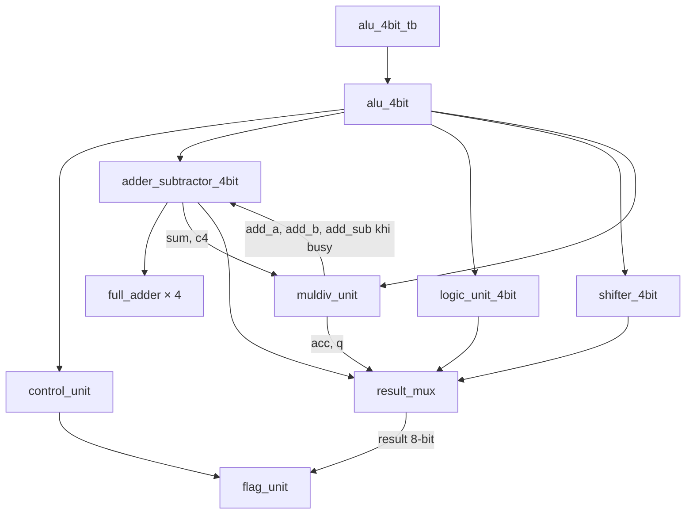

# Kiến trúc theo nguồn

Căn cứ: báo cáo ALU trang 3–18, Appendix trang 21–27 và gate diagrams trang 1–5. [source_traceability.md](source_traceability.md) liên kết các nguồn tương ứng.

| File RTL | Trách nhiệm |
|---|---|
| `full_adder.v` | `p=a XOR b`, `g=a AND b`, `sum=p XOR cin`, `cout=g OR (p AND cin)` bằng 2 XOR, 2 AND và 1 OR |
| `adder_subtractor_4bit.v` | Bốn full adder ripple-carry; B XOR `sub`, carry đầu vào bằng `sub`; xuất `sum`, `c3`, `c4` |
| `logic_unit_4bit.v` | AND, OR, XOR, NOT tính song song |
| `shifter_4bit.v` | SHL/SHR logic một bit bằng nối dây và xuất bit bị đẩy ra |
| `control_unit.v` | Giải mã `sub`, `arith`, `is_shl`, `is_shr`, `is_div`, `is_muldiv` |
| `muldiv_unit.v` | Thanh ghi `acc`, `q`, `m`, counter 2-bit, trạng thái chạy và mode đã chốt; điều khiển shared adder |
| `result_mux.v` | Chọn kết quả 8-bit theo opcode, zero-extend phép 4-bit, opcode chưa dùng trả 0 |
| `flag_unit.v` | Tạo cờ carry, zero, overflow, negative |
| `alu_4bit.v` | Nối các module, chọn chủ sở hữu adder theo busy và gate cờ chia cho 0 theo opcode |

`muldiv_unit` là module design duy nhất có clock. Khi rảnh, adder nhận `a`, `b`, `sub`; khi `busy=1`, nhận `add_a`, `add_b`, `add_sub` từ MUL/DIV. MUL/DIV đọc lại `sum`, `c4` của chính bộ cộng đó. Vì adder đang bị dùng, việc đổi opcode sang ADD/SUB trong thời gian busy không cung cấp một phép ADD/SUB độc lập trên đầu vào ngoài.

## Thuật toán MUL/DIV

MUL unsigned nạp `acc=0`, `q=b`, `m=a`. Mỗi bước cộng `m` vào `acc` nếu `q[0]=1`, rồi dịch phải `{carry, acc, q}`. Nếu `q[0]=0`, dịch với carry bằng 0. Sau bốn bước, `{acc,q}` là tích 8-bit.

DIV unsigned nạp `acc=0`, `q=a`, `m=b`. Mỗi bước dịch trái `{acc,q}`, thử trừ `m` khỏi phần số dư qua adder. Nếu trừ được thì giữ hiệu và thêm bit thương 1, nếu không thì giữ phần số dư sau dịch và thêm bit thương 0. Theo Appendix trang 25, điều kiện `fits` tính bằng bit cao bị dịch khỏi `acc` OR `add_c4` (carry của phép trừ, 1 nghĩa là không mượn). Sau bốn bước, `acc` là số dư và `q` là thương.

Khi chia cho 0, thuật toán vẫn chạy đủ số bước, cho `q=1111`, `acc=a`. Cờ nội bộ chốt tại start bằng `is_div && b==0`; cổng top-level là `is_div & md_dbz` theo Appendix trang 22.

## Giao thức và kết quả

| Cạnh lên | Hành động | Trạng thái sau cạnh |
|---|---|---|
| 1 | Chấp nhận start khi rảnh, nạp dữ liệu và mode | `busy=1`, `done=0`, count=0 |
| 2 | Bước 1 | `busy=1`, `done=0` |
| 3 | Bước 2 | `busy=1`, `done=0` |
| 4 | Bước 3 | `busy=1`, `done=0` |
| 5 | Bước 4 | `busy=0`, `done=1`, kết quả cuối |

Độ trễ trong báo cáo được đếm là **5 cạnh clock gồm cạnh nạp**, tương đương 4 chu kỳ clock kể từ cạnh chấp nhận start đến cạnh hoàn thành. `start` phải là xung một clock. Start trong lúc đang chạy không nạp giao dịch mới. `done` giữ mức 1 đến start được chấp nhận kế tiếp hoặc reset; không phải xung một clock.

Đầu ra MUL/DIV nối trực tiếp từ `{acc,q}`, nên thể hiện các giá trị trung gian trong lúc busy, đúng waveform trang 9–10. Sau khi hoàn tất, các thanh ghi giữ kết quả đến lần start được chấp nhận tiếp theo hoặc reset. Result mux vẫn theo opcode hiện tại; giữ opcode MUL/DIV khi đọc kết quả. Mode và toán hạng tính toán đã được chốt lúc start.

Reset bất đồng bộ active high xóa thanh ghi, busy, done và cờ chia cho 0 của MUL/DIV. Nhánh tổ hợp ADD/SUB/logic/shift vẫn phụ thuộc đầu vào; reset không phải tín hiệu ép mọi kết quả tổ hợp về 0.

## Cờ

| Cờ | Công thức / ngữ nghĩa |
|---|---|
| `carry` | `(arith & c4) \| (is_shl & a[3]) \| (is_shr & a[0])`; SUB: 1 là không mượn |
| `overflow` | `arith & (c3 ^ c4)`; chỉ đánh giá signed overflow cho ADD/SUB |
| `zero` | `~\|result[7:0]` |
| `negative` | `~is_muldiv & result[3]` |
| `div_by_zero` | `is_div & md_dbz`, với `md_dbz` chốt tại start |

MUL/DIV là unsigned nên carry, overflow và negative bằng 0. Cờ zero của DIV xét cả số dư và thương.
